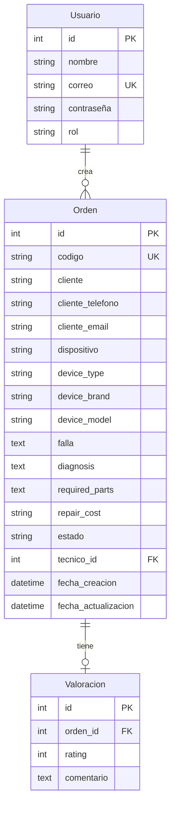

<div align="center">

# 🔧✨ JOSETEC 
### Sistema Inteligente de Gestión de Reparaciones


---

**🚀 Transforma la manera de gestionar tus reparaciones con tecnología de vanguardia**

*Un sistema web completo y moderno que conecta técnicos con clientes en tiempo real*

[🌟 Demo](#-características-principales) • [📦 Instalación](#-instalación-y-configuración) • [📖 Documentación](#-uso-del-sistema) • [🤝 Contribuir](#-contribución)

---

</div>

## ✨ Características Principales

<table>
<tr>
<td width="50%">

### 👨‍🔧 Panel de Técnico

```diff
+ Crear órdenes de reparación completas
+ Dashboard con estadísticas en tiempo real
+ Búsqueda rápida por código
+ Gestión de estados con flujo visual
+ Validación inteligente de clientes
+ Modal de confirmación para acciones críticas
```

**Estados del flujo:**
```
RECIBIDO → EN DIAGNÓSTICO → ESPERA DE APROBACIÓN 
→ EN REPARACIÓN → REPARADO → ENTREGADO ✅
```

</td>
<td width="50%">

### 👤 Panel de Cliente

```diff
+ Seguimiento en tiempo real 24/7
+ Interfaz ultra responsive
+ Sistema de valoraciones con estrellas
+ Progreso visual del estado
+ Acceso seguro con validación
+ Notificaciones de cambios de estado
```

**Experiencia del cliente:**
```
📱 Buscar → 👀 Seguir → ⭐ Calificar
```

</td>
</tr>
</table>

---

### 🔐 Seguridad de Nivel Empresarial

<div align="center">

| Característica | Descripción |
|:---:|:---|
| �️ **Encriptación** | Contraseñas con hash Werkzeug |
| � **CSRF Protection** | Tokens en todos los formularios |
| ✅ **Validación Dual** | Frontend (HTML5+JS) + Backend (Python) |
| 👁️ **Password Toggle** | Visibilidad controlada de contraseñas |
| � **Control de Acceso** | Validación de roles y permisos |
| 📧 **Email Verification** | Formato y unicidad garantizados |

</div>

---

## 🛠️ Stack Tecnológico

<div align="center">

### Backend Powerhouse 💪


**Flask 3.0+** • **SQLAlchemy ORM** • **Flask-Migrate** • **Python 3.11+**

---

### Frontend Moderno 🎨


**TailwindCSS 3.0+** • **Vanilla JavaScript** • **Responsive Design** • **Custom Animations**

---

### Base de Datos 💾


**SQLite** (desarrollo) • **PostgreSQL/MySQL** (producción)

</div>

---

## 📦 Estructura del Proyecto

```
📁 Proyecto_JTec/
│
├── 🚀 app.py                           # Core de la aplicación Flask
├── 📋 requirements.txt                  # Dependencias del proyecto
│
├── 💾 instance/
│   └── database.db                      # Base de datos SQLite
│
├── 🗂️ models/
│   └── models.py                        # 📊 Modelos: Usuario, Orden, Valoracion
│
├── 🎮 controller/
│   ├── auth_controller.py               # 🔐 Autenticación y registro
│   ├── client_controller.py             # 👤 Lógica del cliente
│   └── technician_controller.py         # 👨‍🔧 Lógica del técnico
│
├── 🎨 templates/
│   ├── base.html                        # 🏗️ Template base responsive
│   ├── login.html                       # 🚪 Inicio de sesión
│   ├── register.html                    # ✍️ Registro de usuarios
│   ├── clientdashboard.html            # 📊 Dashboard del cliente
│   ├── clientInterface.html            # 🔍 Consulta pública
│   ├── TechnicianDashboard.html        # 🛠️ Dashboard del técnico
│   └── TechnicianInterface.html        # ⚙️ Interfaz alternativa
│
├── 🎭 static/
│   ├── css/
│   │   └── style.css                    # 💅 Estilos personalizados
│   ├── js/
│   │   └── script.js                    # ⚡ JavaScript interactivo
│   └── img/
│       └── ImageTec.png                 # 🖼️ Logo JOSETEC
│
└── 🔄 migrations/                       # Migraciones Alembic
    ├── alembic.ini
    ├── env.py
    └── versions/
```

---

## 🚀 Instalación y Configuración

### 📋 Prerrequisitos

<div align="center">

| Requisito | Versión Mínima |
|:---:|:---:|
| 🐍 Python | 3.11+ |
| 📦 pip | Latest |
| 🌿 Git | Latest |

</div>

### ⚡ Instalación Rápida

<details>
<summary>🪟 <b>Windows</b></summary>

```powershell
# 1. Clonar el repositorio
git clone https://github.com/Japaricio2004/ProjectJTec.git
cd ProjectJTec

# 2. Crear entorno virtual
python -m venv venv
venv\Scripts\activate

# 3. Instalar dependencias
pip install -r requirements.txt

# 4. Inicializar base de datos
flask db upgrade

# 5. ¡Lanzar! 🚀
python app.py
```

</details>

<details>
<summary>🐧 <b>Linux / Mac</b></summary>

```bash
# 1. Clonar el repositorio
git clone https://github.com/Japaricio2004/ProjectJTec.git
cd ProjectJTec

# 2. Crear entorno virtual
python3 -m venv venv
source venv/bin/activate

# 3. Instalar dependencias
pip install -r requirements.txt

# 4. Inicializar base de datos
flask db upgrade

# 5. ¡Lanzar! 🚀
python app.py
```

</details>

<div align="center">

### 🎉 ¡Listo! La aplicación está corriendo en:

**`http://127.0.0.1:5000`**

</div>

## 📝 Uso del Sistema

### Registro de Usuarios

1. Accede a `/register`
2. Selecciona tu rol (Cliente o Técnico)
3. Completa el formulario con:
   - Nombre completo (mínimo 3 caracteres)
   - Email válido
   - Contraseña (mínimo 6 caracteres)
   - Confirmación de contraseña

### Flujo de Trabajo del Técnico

1. **Iniciar sesión** como técnico
2. **Crear nueva orden**:
   - Ingresar datos del cliente (nombre, teléfono, email)
   - Ingresar datos del dispositivo (tipo, marca, modelo)
   - Describir la falla reportada
3. **Gestionar órdenes existentes**:
   - Buscar por código de seguimiento
   - Actualizar diagnóstico, piezas y costo
   - Cambiar estado de la orden
   - Eliminar órdenes si es necesario

### Flujo de Trabajo del Cliente

1. **Iniciar sesión** como cliente
2. **Buscar mi reparación**:
   - Ingresar código de seguimiento
   - Ver estado actual y progreso
   - Ver diagnóstico y costo (si están disponibles)
3. **Calificar el servicio** (solo órdenes entregadas):
   - Seleccionar calificación (1-5 estrellas)
   - Agregar comentario opcional

---

## 🎨 Diseño Responsive

<div align="center">

### 📱 Adaptable a Cualquier Dispositivo

| Dispositivo | Resolución | Características |
|:---:|:---:|:---|
| 📱 **Móvil** | 320px - 640px | • Layout vertical apilado<br>• Menú hamburguesa<br>• Botones táctiles grandes |
| 📲 **Tablet** | 641px - 1023px | • Layout de 2 columnas<br>• Navegación completa<br>• Optimización táctil |
| 💻 **Desktop** | 1024px+ | • Grids de hasta 4 columnas<br>• Dashboard completo<br>• Experiencia premium |

</div>

---

## 🗺️ Rutas de la API

<table>
<tr>
<td width="50%">

### 🔐 Autenticación

```http
GET  /login           # Página de inicio de sesión
POST /login           # Autenticar usuario
GET  /register        # Página de registro
POST /register        # Crear nuevo usuario
GET  /logout          # Cerrar sesión
```

</td>
<td width="50%">

### 👤 Cliente

```http
GET  /                # Interfaz pública
GET  /cliente         # Dashboard cliente
POST /cliente/buscar  # Buscar orden
POST /cliente/valorar # Calificar servicio
```

</td>
</tr>
<tr>
<td width="50%" colspan="2">

### 👨‍🔧 Técnico

```http
GET  /technician                              # Dashboard técnico
POST /technician                              # Crear orden
GET  /technician/interface                    # Interfaz alternativa
POST /technician/interface/create             # Crear orden
POST /technician/interface/update/<code>      # Actualizar orden
POST /technician/interface/delete/<code>      # Eliminar orden
```

</td>
</tr>
</table>

---

## � Modelos de Base de Datos

<div align="center">

### 🗄️ Esquema de Datos



</div>

---

## 🤝 Contribución

<div align="center">

### ¿Quieres contribuir? ¡Genial! 🎉

Seguimos el flujo de trabajo **Git Flow**:

```bash
# 1️⃣ Fork el proyecto
# 2️⃣ Crea tu rama feature
git checkout -b feature/AmazingFeature

# 3️⃣ Commit tus cambios
git commit -m '✨ Add: AmazingFeature'

# 4️⃣ Push a la rama
git push origin feature/AmazingFeature

# 5️⃣ Abre un Pull Request
```

### 🏷️ Convenciones de Commits

| Emoji | Tipo | Descripción |
|:---:|:---:|:---|
| ✨ | `feat:` | Nueva característica |
| 🐛 | `fix:` | Corrección de bug |
| 📝 | `docs:` | Documentación |
| 💄 | `style:` | Estilos/UI |
| ♻️ | `refactor:` | Refactorización |
| ⚡ | `perf:` | Mejora de rendimiento |
| ✅ | `test:` | Tests |

</div>

## 📄 Licencia

Este proyecto está bajo la Licencia MIT. Ver el archivo `LICENSE` para más detalles.

## 👤 Autor

**Japaricio2004**
- GitHub: [@Japaricio2004](https://github.com/Japaricio2004)

## 🙏 Agradecimientos

- Flask por el excelente framework web
- TailwindCSS por el sistema de diseño utility-first
- La comunidad de Python por las herramientas y librerías

---

⭐ Si este proyecto te resultó útil, considera darle una estrella en GitHub!
